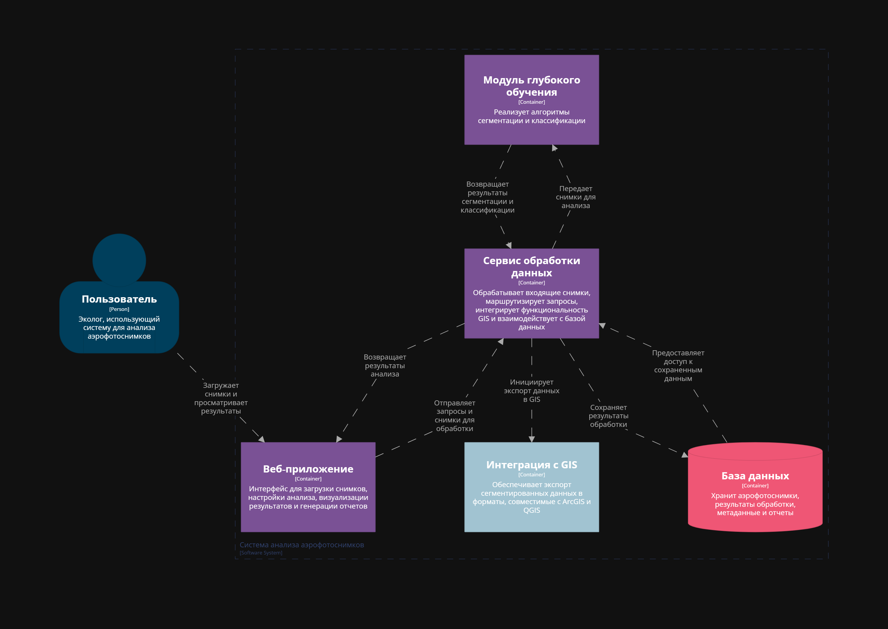
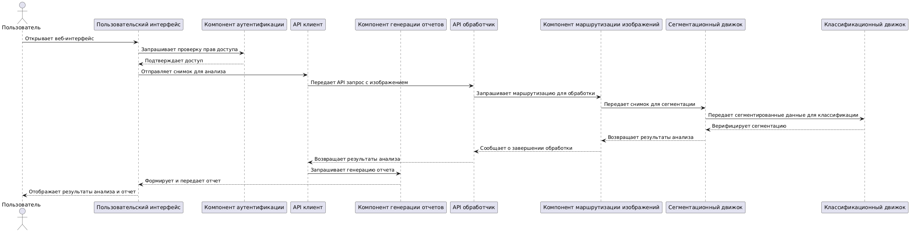

# Лабораторная работа №2

### Диаграмма системного контекста
---

---
### Диаграмма контейнеров
---
**Описание и обоснование выбора архитектурного стиля**

Показывает распределённую архитектуру системы с выделением пяти контейнеров (Веб‑приложение, Сервис обработки данных, Модуль глубокого обучения, Интеграция с GIS и База данных)

Такой  архитектурный стиль выбран по причине возможности развёртывания отдельных модулей на разных серверах, что повышает масштабируемость, упрощает сопровождение и обеспечивает надёжное сетевое взаимодействие между компонентами.

---
### Диаграммы компонентов
---
**Диаграмма для модуля "Сервиса обработки данных"**

Отображает внутренние компоненты сервиса (API обработчик, Компонент маршрутизации изображений, Коннектор к базе данных), а также внешние связи с другими контейнерами (Веб‑приложение, Модуль глубокого обучения, Интеграция с GIS и База данных).

---
**Диаграмма для Модуля "Веб-приложение"**

Демонстрирует внутреннюю структуру веб‑приложения и внешнее взаимодействие с Сервисом обработки данных.

