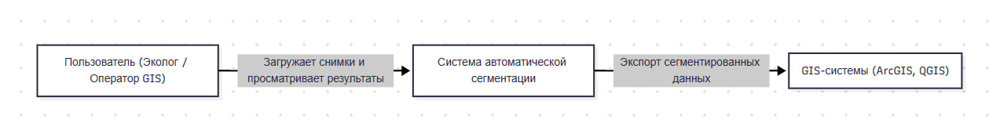
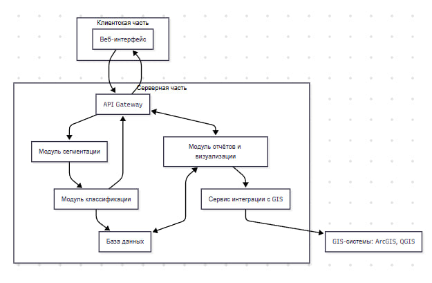
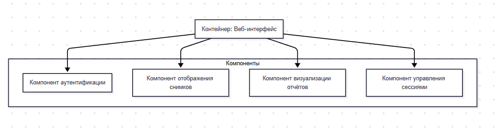

# Лабораторная работа №3


---
### Диаграмма контейнеров
---

Ниже представлена упрощённая диаграмма контейнеров, где выделён контейнер «Модуль сегментации», который далее детализируется на диаграмме компонентов. Такая структура отражает разделение функциональности на клиентскую и серверную части, а также базу данных.

**Описание:**

- Веб-интерфейс – обеспечивает взаимодействие пользователя с системой.
- API Gateway – принимает запросы и маршрутизирует их к нужным сервисам.
- Модуль сегментации – реализует логику обработки изображений с использованием нейронной сети.
- База данных – хранит информацию о загруженных снимках, результатах сегментации и конфигурациях модели.



---
### Диаграммы компонентов

Для контейнера «Модуль сегментации» представлена диаграмма компонентов, демонстрирующая внутреннюю структуру, где выделены отдельные компоненты, непосредственно реализующие бизнес-логику, а также те, на которых будет базироваться демонстрация принципов разработки.

**Описание:**
- Компонент загрузки снимков – отвечает за приём изображений от API.
- Компонент предварительной обработки – выполняет нормализацию и подготовку данных для сегментации.
- Компонент нейронной сети – осуществляет основную задачу сегментации.
- Компонент пост-обработки – корректирует и оптимизирует результаты сегментации.
- Компонент управления потоками – обеспечивает параллельную обработку и контроль над производительностью.


---
---
### Диаграмма последовательностей

Для выбранного варианта использования (загрузка снимка и его обработка с последующим сохранением результата) представлена диаграмма последовательностей, иллюстрирующая взаимодействие между компонентами.

**Описание:**

Пользователь загружает снимок через веб-интерфейс, который отправляет запрос на API Gateway. Запрос перенаправляется в модуль сегментации, где происходит последовательная обработка: предварительная подготовка, сегментация нейронной сетью, пост-обработка и сохранение результатов в базу данных. Затем результат возвращается пользователю.


---
---
### Модель БД (UML диаграмма классов)

Ниже представлена модель базы данных, включающая 5 основных сущностей, необходимых для хранения информации о пользователях, снимках, результатах сегментации, отчетах и конфигурации модели.

**Описание:**

User – хранит информацию о пользователях системы.
Image – содержит данные о загруженных снимках.
SegmentationResult – результаты обработки снимков, включая метрики точности.
Report – отчеты, сформированные на основе результатов сегментации.
ModelConfig – настройки и параметры используемой модели сегментации.


---

---
### Применение основных принципов разработки
---
**KISS (Keep It Simple, Stupid) – Держи всё просто**

Принцип KISS предписывает, чтобы дизайн системы был максимально простым. Сложность должна быть минимизирована, а избыточная функциональность исключена, если она не приносит явной пользы.


При реализации решений нужно стремиться к простоте как в архитектуре, так и в коде. Это позволяет уменьшить количество ошибок, упростить тестирование и сопровождение, а также быстрее вносить изменения.

*Как применено в проекте:*

Модули системы (например, загрузка изображений, обработка и сегментация) разделены на отдельные классы с чётко определённой функциональностью.
Интерфейсы API и взаимодействия между компонентами разработаны так, чтобы не было лишних уровней абстракции.
Пример функции обработки изображения реализован максимально лаконично, без избыточного функционала, что облегчает понимание и сопровождение кода.

*Преимущества:*

- Легкость поддержки и расширения кода.
- Быстрое обнаружение и устранение ошибок.
- Более понятная архитектура, способствующая эффективной командной работе.

*Пример:*

```
# Простой вариант функции обработки изображения
def process_image(image):
    # Загрузка изображения, базовая предобработка, запуск сегментации и пост-обработка
    processed = basic_preprocessing(image)
    segmentation_result = run_segmentation(processed)
    final_result = postprocessing(segmentation_result)
    return final_result

```

**YAGNI (You Aren't Gonna Need It) – Тебе это не понадобится**

Принцип YAGNI указывает, что не следует реализовывать функциональность, пока она не понадобится. Разработчики часто добавляют дополнительные возможности «на всякий случай», что приводит к излишней сложности.

Вместо того чтобы строить систему с поддержкой множества функций, которые могут никогда не использоваться, лучше сосредоточиться на реализации только тех требований, которые определены на данный момент. Это позволяет избежать ненужной работы и облегчить дальнейшую поддержку.

*Как применено в проекте:*

В прототипе системы реализована только базовая функциональность: загрузка изображений, их обработка и отображение результатов.
Дополнительные возможности добавляются только после получения обратной связи от пользователей.

*Преимущества:*

- Сокращение затрат времени и усилий на разработку.
- Уменьшение технического долга и упрощение кода.
- Фокусировка на реальных потребностях пользователей.

*Пример (концептуальный):*

Вместо реализации универсального модуля для обработки любых типов изображений, система сначала поддерживает обработку стандартных JPEG-файлов. Если в будущем появится необходимость работы с другими форматами, функциональность будет добавлена по мере необходимости.

**DRY (Don't Repeat Yourself) – Не повторяй себя**

Принцип DRY гласит, что дублирование кода должно быть сведено к минимуму. Каждая логическая единица должна быть реализована только один раз, а повторное использование кода осуществляется через вызовы функций или модулей.

Повторение одного и того же кода увеличивает риск ошибок при внесении изменений. Если один кусок функциональности реализован в нескольких местах, то изменения нужно вносить во всех копиях, что увеличивает вероятность рассинхронизации.

*Как применено в проекте:*

Общие функции вынесены в отдельные утилитарные модули.
Реализация различных методов работы с данными происходит через единый интерфейс, который используется в разных частях приложения.
Код автотестов также использует общие шаблоны и функции для проверки ответов API, что позволяет избежать дублирования логики проверки.

*Преимущества:*

Легкость внесения изменений: исправление ошибки в одном месте приводит к корректной работе всей системы.
Повышение читаемости и уменьшение объёма кода.
Упрощение тестирования и поддержки.

*Пример:*
```
# Функция для логирования ошибок, используемая во всех модулях системы
def log_error(error_message):
    with open('error.log', 'a') as log_file:
        log_file.write(f"{datetime.now()}: {error_message}\n")

# Вместо дублирования логирования в каждом модуле, вызываем log_error()
try:
    result = process_image(image)
except Exception as e:
    log_error(str(e))
```

### SOLID

**Single Responsibility Principle (SRP) – Принцип единственной ответственности**

Каждый класс (или модуль) должен иметь только одну ответственность – одну причину для изменения. То есть класс должен фокусироваться только на одном функциональном аспекте системы.

SRP гарантирует, что изменения в одном аспекте системы не приведут к необходимости вносить изменения в классы, не связанные с этим аспектом. Это упрощает тестирование, отладку и поддержку кода.

*Как применено в проекте:*

В модуле сегментации изображений логика разделена на несколько компонентов: загрузка, предварительная обработка, основная сегментация и пост-обработка. Например, функция process_image() отвечает только за обработку изображения, а функции загрузки и сохранения данных реализованы отдельно.

**Open-Closed Principle (OCP) – Принцип открытости/закрытости**

Программные сущности (классы, модули, функции) должны быть открыты для расширения, но закрыты для модификации. Это означает, что поведение системы можно изменять, добавляя новый код, а не изменяя уже существующий.

Осуществляется через абстракции, интерфейсы или наследование. При добавлении новой функциональности создаются новые классы, реализующие общий интерфейс, что позволяет не трогать стабильный, протестированный код.

*Как применено в проекте:*

В случае для реализации разных алгоритмов сегментации можно создать абстрактный класс SegmentationAlgorithm, от которого будут наследоваться конкретные реализации (например, CNNSegmentation, TransformerSegmentation и т.д.). При этом изменения в одной реализации не затрагивают базовый контракт.

**Liskov Substitution Principle (LSP) – Принцип подстановки Лисков**

Объекты подклассов должны без проблем заменять объекты базовых классов. То есть, если класс B является подклассом класса A, то объекты типа A могут быть заменены объектами типа B без нарушения корректности работы программы.

LSP требует, чтобы поведение подклассов соответствовало ожиданиям, заданным базовым классом. Это позволяет писать универсальный код, который работает с абстракциями, не заботясь о конкретных реализациях.

*Как применено в проекте:*

В архитектуре сегментации, если все алгоритмы наследуют общий интерфейс SegmentationAlgorithm, то любая функция, работающая с этим интерфейсом (например, process_image()), сможет использовать любую конкретную реализацию сегментации (CNN, Transformer, YOLO) без необходимости менять свой код.

**Interface Segregation Principle (ISP) – Принцип разделения интерфейса**

Клиенты не должны вынуждаться зависеть от методов, которые они не используют. Лучше разделять большие интерфейсы на более мелкие, специфичные для конкретного клиента.

ISP помогает избежать создания «толстых» интерфейсов, где класс обязан реализовывать методы, не относящиеся к его функциональности. Это снижает зависимость между модулями и упрощает поддержку кода.

*Как применено в проекте:*

В  системе вместо одного большого интерфейса для работы с изображениями можно создать отдельные интерфейсы: один для загрузки и сохранения изображений, другой для сегментации, третий для экспорта результатов. Таким образом, классы реализуют только те методы, которые им действительно нужны.

**Dependency Inversion Principle (DIP) – Принцип инверсии зависимостей**

Модули верхнего уровня не должны зависеть от модулей нижнего уровня. Оба должны зависеть от абстракций. Абстракции не должны зависеть от деталей, а детали – от абстракций.

DIP позволяет создавать гибкую архитектуру, где конкретные реализации можно подменять без изменения кода, использующего абстракции. Это достигается за счёт внедрения зависимостей (dependency injection) и использования интерфейсов.

*Как применено в проекте:*

В нашем API вместо жесткой привязки к конкретной реализации алгоритма сегментации, высокоуровневый модуль принимает зависимость в виде интерфейса SegmentationAlgorithm. Это позволяет легко заменять алгоритмы, проводить юнит-тестирование с использованием моков, а также упрощает масштабирование и обновление системы.

---
### Дополнительные принципы разработки

---

**BDUF (Big Design Up Front) – Масштабное проектирование прежде всего**

BDUF предполагает, что на начальном этапе проекта выполняется детальное проектирование всей системы, включая архитектуру, модели данных и интерфейсы, прежде чем начинается реализация.

Такой подход нацелен на минимизацию риска масштабных изменений в будущем и снижение технического долга за счёт тщательного анализа требований и проектирования системы с самого начала.

*Как применено в проекте:*

В данном проекте отказ от полного BDUF выбран сознательно. Вместо масштабного предварительного проектирования используется итеративный подход, ориентированный на MVP. Это позволяет на раннем этапе создать прототип (PoC), собрать обратную связь, а затем постепенно расширять и уточнять архитектуру. Такой подход снижает затраты времени и риска «переделок», поскольку не требуется детально проектировать каждый модуль заранее.

*Преимущества подхода (при использовании BDUF):*

- Полное понимание архитектуры и всех взаимосвязей.
- Чётко задокументированные требования и спецификации.

*Преимущества отказа от BDUF:*

- Гибкость в изменениях по ходу разработки.
- Быстрая реакция на новые требования и обратную связь.
- Сокращение времени на начальные этапы разработки.

*Пример (концептуальный):*

Вместо того чтобы сразу проектировать всю систему сегментации, команда сначала разработала минимальный жизнеспособный продукт (MVP), реализовав основные функции: загрузку изображения и его обработку. Это позволило быстро получить первые результаты и скорректировать архитектуру перед добавлением дополнительных возможностей.

**SoC (Separation of Concerns) – Принцип разделения ответственности**

SoC подразумевает разделение системы на отдельные модули или компоненты, каждый из которых отвечает за свою конкретную функциональность. Это уменьшает взаимозависимость между частями системы.

При соблюдении SoC каждая функциональная область (например, загрузка данных, обработка изображений, генерация отчётов) реализуется в виде отдельного компонента или сервиса. Это упрощает отладку, тестирование и дальнейшее развитие системы.

*Как применено в проекте:*

В проекте по сегментации аэрофотоснимков функциональность разделена на отдельные модули:

- Модуль загрузки изображений
- Модуль предварительной обработки
- Модуль сегментации
- Модуль пост-обработки
- Модуль экспорта данных в GIS

Каждый модуль имеет свою четко определённую ответственность и взаимодействует с другими через хорошо определённые интерфейсы.

*Преимущества:*

- Улучшенная модульность и масштабируемость.
- Легкость поддержки и тестирования отдельных компонентов.
- Снижение взаимозависимости между частями системы.

*Пример:*

```
# Пример разделения ответственности:
class ImageLoader:
    def load(self, file_path):
        # Код для загрузки изображения
        pass

class ImageProcessor:
    def process(self, image):
        # Код для обработки изображения (сегментация)
        pass

class ImageExporter:
    def export(self, segmentation_result, format_type):
        # Код для экспорта данных в нужном формате (GeoTIFF, Shapefile)
        pass
```

**MVP (Minimum Viable Product) – Минимально жизнеспособный продукт**

MVP – это базовая версия продукта, содержащая только основные функции, необходимые для демонстрации ценности решения и получения обратной связи от пользователей.

MVP позволяет быстро запустить рабочую версию системы с минимальными затратами ресурсов, тестировать гипотезы и собирать отзывы, прежде чем инвестировать в полную функциональность.

*Как применено в проекте:*

В проекте выбран подход MVP для разработки прототипа системы автоматической сегментации аэрофотоснимков. На первом этапе реализуются критически важные функции:

- Загрузка изображений
- Запуск алгоритма сегментации
- Отображение результатов

Далее, исходя из полученной обратной связи, планируется расширение функционала (например, добавление модулей отчётности, интеграция с GIS, улучшенные методы обработки).

*Преимущества:*

- Быстрый запуск и тестирование гипотез.
- Снижение затрат на разработку.
- Возможность адаптации к требованиям пользователей на раннем этапе.

*Пример (концептуальный):*

Первоначально система реализована с базовой функциональностью – загрузка и обработка изображений. После получения первых результатов и отзывов пользователей, планируется расширение функционала за счёт добавления модулей генерации отчётов и поддержки дополнительных форматов экспорта.

**PoC (Proof of Concept) – Доказательство концепции**

PoC – это реализация прототипа, цель которого показать работоспособность и жизнеспособность ключевых идей проекта, без полной реализации функционала.

PoC используется для проверки гипотез, оценки технологических решений и определения целесообразности дальнейшей разработки. Он помогает выявить возможные проблемы на ранних этапах.

*Как применено в проекте:*

В рамках ВКР был разработан PoC, демонстрирующий, что алгоритмы сегментации на основе нейронных сетей способны корректно обрабатывать аэрофотоснимки и выделять зоны техногенной трансформации. PoC подтвердил, что выбранная архитектура (с применением CNN, Transformer или гибридных методов) удовлетворяет требованиям по точности и скорости обработки, что послужило обоснованием для дальнейшей разработки полной системы.

*Преимущества:*

- Быстрая проверка жизнеспособности ключевой идеи.
- Возможность раннего выявления технических ограничений.
- Обоснование выбора технологий и архитектурных решений.

*Пример (концептуальный):*

В ходе PoC была реализована базовая версия алгоритма сегментации, которая показала точность выше 80% при обработке тестового набора снимков. Это позволило команде утвердиться в выборе нейронной сети и перейти к разработке полнофункциональной системы.