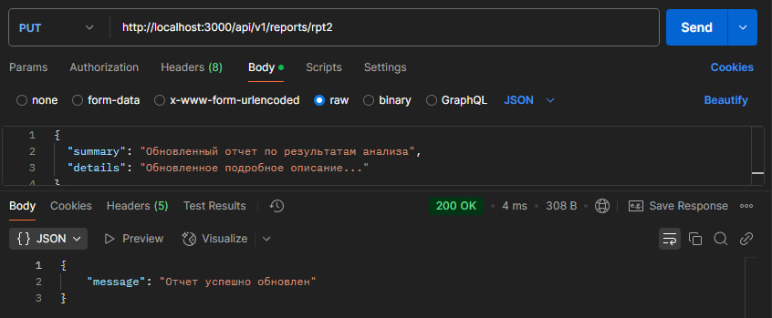

# REST API Документация для Системы анализа аэрофотоснимков


Данная документация описывает REST API для сервиса обработки данных системы анализа аэрофотоснимков, предназначенного для автоматизированного обнаружения и сегментации зон техногенных трансформаций. API разработан согласно принципам RESTful архитектуры и использует стандартные HTTP-методы (GET, POST, PUT, DELETE).

## Проектные решения

1. **RESTful архитектура:** API спроектирован в соответствии с принципами REST.
2. **Стандартные HTTP-методы:** Используются GET (получение данных), POST (создание новых ресурсов), PUT (обновление существующих ресурсов) и DELETE (удаление ресурсов).
3. **Версионирование:** Все эндпоинты начинаются с `/api/v1/`, что обеспечивает поддержку будущих версий.
4. **Формат данных JSON:** Все запросы и ответы используют JSON-формат.
5. **Понятные URL:** Имена ресурсов во множественном числе (например, `/images`, `/reports`).
6. **Стандартные HTTP-коды:** Используются коды 200, 201, 400, 404, 500 для информирования клиента о результате операции.
7. **Валидация данных:** На стороне сервера реализована валидация входных данных с возвращением информативных сообщений об ошибках.
8. **Безопасность:** API предусматривает использование токенов авторизации для защиты эндпоинтов (опционально).

## Описание эндпоинтов

### 1. Загрузка снимка
- **Метод:** POST  
- **URL:** `/api/v1/images`  
- **Описание:** Загружает новый снимок для анализа.  
- **Запрос:**
  - **Заголовки:** `Content-Type: multipart/form-data`
  - **Параметры:**  
    - `image` (файл): изображение (JPEG, PNG)  
    - `metadata` (JSON): дополнительные данные (например, геолокация, дата съемки)
- **Ответ:**
  - **Код:** 201 Created  
  - **Тело:**
    ```json
    {
      "id": "123",
      "status": "processing",
      "message": "Изображение загружено и обработка запущена"
    }
    ```

### 2. Получение списка снимков
- **Метод:** GET  
- **URL:** `/api/v1/images`  
- **Описание:** Возвращает список загруженных снимков с базовой информацией.  
- **Запрос:** Опциональные параметры: `page`, `limit`, `status`  
- **Ответ:**
  - **Код:** 200 OK  
  - **Тело:**
    ```json
    [
      {
        "id": "123",
        "status": "processed",
        "uploadedAt": "2025-03-01T10:00:00Z"
      },
      {
        "id": "124",
        "status": "processing",
        "uploadedAt": "2025-03-02T12:30:00Z"
      }
    ]
    ```

### 3. Получение информации о снимке
- **Метод:** GET  
- **URL:** `/api/v1/images/{id}`  
- **Описание:** Возвращает подробную информацию о выбранном снимке.  
- **Запрос:** Параметр `id` – уникальный идентификатор снимка  
- **Ответ:**
  - **Код:** 200 OK  
  - **Тело:**
    ```json
    {
      "id": "123",
      "status": "processed",
      "metadata": {
         "location": "55.7558, 37.6176",
         "capturedAt": "2025-03-01T09:50:00Z"
      },
      "analysis": {
         "segmentationResult": "ссылка на файл",
         "classification": "техногенные трансформации"
      }
    }
    ```
- **Ошибки:** При отсутствии снимка возвращается 404 Not Found.

### 4. Обновление информации о снимке
- **Метод:** PUT  
- **URL:** `/api/v1/images/{id}`  
- **Описание:** Обновляет метаданные или статус снимка.  
- **Запрос:**
  - **Заголовки:** `Content-Type: application/json`
  - **Тело:**
    ```json
    {
      "metadata": {
         "location": "55.7558, 37.6176",
         "capturedAt": "2025-03-01T09:50:00Z"
      },
      "status": "processed"
    }
    ```
- **Ответ:**
  - **Код:** 200 OK  
  - **Тело:**
    ```json
    {
      "message": "Данные успешно обновлены"
    }
    ```

### 5. Удаление снимка
- **Метод:** DELETE  
- **URL:** `/api/v1/images/{id}`  
- **Описание:** Удаляет снимок из системы.  
- **Запрос:** Параметр `id`  
- **Ответ:**
  - **Код:** 200 OK  
  - **Тело:**
    ```json
    {
      "message": "Снимок успешно удален"
    }
    ```

### 6. Получение списка отчетов
- **Метод:** GET  
- **URL:** `/api/v1/reports`  
- **Описание:** Возвращает список сформированных отчетов по результатам анализа.  
- **Запрос:** Опциональные параметры: `page`, `limit`, `date`  
- **Ответ:**
  - **Код:** 200 OK  
  - **Тело:**
    ```json
    [
      {
        "id": "rpt123",
        "createdAt": "2025-03-01T11:00:00Z",
        "summary": "Обнаружены техногенные трансформации в зоне A"
      },
      {
        "id": "rpt124",
        "createdAt": "2025-03-02T15:30:00Z",
        "summary": "Обнаружены изменения в зоне B"
      }
    ]
    ```

### 7. Создание отчета
- **Метод:** POST  
- **URL:** `/api/v1/reports`  
- **Описание:** Создает новый отчет на основе результатов анализа.  
- **Запрос:**
  - **Заголовки:** `Content-Type: application/json`
  - **Тело:**
    ```json
    {
      "imageId": "123",
      "summary": "Обнаружены техногенные трансформации в зоне A",
      "details": "Подробное описание результатов анализа..."
    }
    ```
- **Ответ:**
  - **Код:** 201 Created  
  - **Тело:**
    ```json
    {
      "id": "rpt123",
      "message": "Отчет успешно создан"
    }
    ```

### 8. Обновление отчета
- **Метод:** PUT  
- **URL:** `/api/v1/reports/{id}`  
- **Описание:** Обновляет данные существующего отчета.  
- **Запрос:**
  - **Заголовки:** `Content-Type: application/json`
  - **Тело:**
    ```json
    {
      "summary": "Обновленный отчет по результатам анализа",
      "details": "Обновленное подробное описание..."
    }
    ```
- **Ответ:**
  - **Код:** 200 OK  
  - **Тело:**
    ```json
    {
      "message": "Отчет успешно обновлен"
    }
    ```

### 9. Удаление отчета
- **Метод:** DELETE  
- **URL:** `/api/v1/reports/{id}`  
- **Описание:** Удаляет отчет из системы.  
- **Запрос:** Параметр `id`  
- **Ответ:**
  - **Код:** 200 OK  
  - **Тело:**
    ```json
    {
      "message": "Отчет успешно удален"
    }
    ```

## Тестирование API

API протестирован с использованием Postman. Примеры тестовых сценариев:


## 1. Эндпоинты для изображений

### 1.1. POST `/api/v1/images` – Загрузка снимка

#### Тест 1: Успешная загрузка снимка
- **Метод:** POST  
- **URL:** `http://localhost:3000/api/v1/images`
- **Вкладка Body:** 
  - Выбрать **form-data**.
  - Поле `image` – тип **File**: валидный файл изображения.
  - Поле `metadata` – тип **Text**: значение в формате JSON:
    ```json
    {"location": "55.7558, 37.6176", "capturedAt": "2025-03-01T09:50:00Z"}
    ```
- **Ожидаемый результат:**
  - Код ответа: **201 Created**.
  - Тело ответа (JSON):
    ```json
    {
      "id": "2",
      "status": "processing",
      "message": "Изображение загружено и обработка запущена"
    }
    ```
- **Скриншот:** 


#### Тест 2: Попытка загрузки без файла
- **Метод:** POST  
- **URL:** `http://localhost:3000/api/v1/images`
- **Вкладка Body:**  
  - Выбрать **form-data**.
  - Не указывать поле `image` или оставить его пустым.
- **Ожидаемый результат:**
  - Код ответа: **400 Bad Request**.
  - Тело ответа (JSON):
    ```json
    {"message": "Файл изображения не найден"}
    ```
- **Скриншот:** 


---

### 1.2. GET `/api/v1/images` – Получение списка снимков

#### Тест 1: Получение списка снимков (предзаполненные данные)
- **Метод:** GET  
- **URL:** `http://localhost:3000/api/v1/images`
- **Ожидаемый результат:**
  - Код ответа: **200 OK**.
  - Тело ответа: массив объектов изображений.
    ```json
    [
      {
        "id": "1",
        "status": "processed",
        "metadata": {"location": "55.7558, 37.6176", "capturedAt": "2025-03-01T09:50:00Z"},
        "uploadedAt": "2025-03-01T10:00:00Z",
        "file": "sample1.jpg",
        "analysis": {
          "segmentationResult": "result_1.jpg",
          "classification": "техногенные трансформации"
        }
      },
      {
        "id": "2",
        "status": "processing",
        "metadata": {"location": "55.7558, 37.6176", "capturedAt": "2025-03-01T09:50:00Z"},
        "uploadedAt": "2025-03-01T10:05:00Z",
        "file": "sample2.jpg"
      }
    ]
    ```
- **Скриншот:** 


#### Тест 2: Проверка ответа при отсутствии снимков
- **Сценарий:** Если удалить все снимки и выполнить GET‑запрос, ожидается, что вернётся пустой массив:
    ```json
    []
    ```
- **Скриншот:** 


---

### 1.3. GET `/api/v1/images/{id}` – Получение информации о конкретном снимке

#### Тест 1: Получение информации по существующему id
- **Метод:** GET  
- **URL:** `http://localhost:3000/api/v1/images/1`
- **Ожидаемый результат:**
  - Код ответа: **200 OK**.
  - Тело ответа: объект изображения с `id` = 1.
- **Скриншот:** 


#### Тест 2: Попытка получения информации по несуществующему id
- **Метод:** GET  
- **URL:** `http://localhost:3000/api/v1/images/999`
- **Ожидаемый результат:**
  - Код ответа: **404 Not Found**.
  - Тело ответа (JSON):
    ```json
    {"message": "Изображение не найдено"}
    ```
- **Скриншот:** 


---

### 1.4. PUT `/api/v1/images/{id}` – Обновление информации о снимке

#### Тест 1: Обновление метаданных и статуса существующего снимка
- **Метод:** PUT  
- **URL:** `http://localhost:3000/api/v1/images/1`
- **Вкладка Body:**  
  - **raw** и **JSON**.
  - тело запроса:
    ```json
    {
      "metadata": {"location": "55.7558, 37.6176", "capturedAt": "2025-03-01T09:55:00Z"},
      "status": "processed"
    }
    ```
- **Ожидаемый результат:**
  - Код ответа: **200 OK**.
  - Тело ответа (JSON):
    ```json
    {"message": "Данные успешно обновлены"}
    ```
- **Скриншот:** 


#### Тест 2: Обновление несуществующего снимка
- **Метод:** PUT  
- **URL:** `http://localhost:3000/api/v1/images/999`
- **Вкладка Body:** JSON с данными.
- **Ожидаемый результат:**
  - Код ответа: **404 Not Found**.
  - Тело ответа (JSON):
    ```json
    {"message": "Изображение не найдено"}
    ```
- **Скриншот:** 


---

### 1.5. DELETE `/api/v1/images/{id}` – Удаление снимка

#### Тест 1: Успешное удаление существующего снимка
- **Метод:** DELETE  
- **URL:** `http://localhost:3000/api/v1/images/1`
- **Ожидаемый результат:**
  - Код ответа: **200 OK**.
  - Тело ответа (JSON):
    ```json
    {"message": "Изображение успешно удалено"}
    ```
- **Скриншот:** 


#### Тест 2: Удаление несуществующего снимка
- **Метод:** DELETE  
- **URL:** `http://localhost:3000/api/v1/images/999`
- **Ожидаемый результат:**
  - Код ответа: **404 Not Found**.
  - Тело ответа (JSON):
    ```json
    {"message": "Изображение не найдено"}
    ```
- **Скриншот:** 


---

## 2. Эндпоинты для отчетов

### 2.1. GET `/api/v1/reports` – Получение списка отчетов

#### Тест 1: Получение списка отчетов
- **Метод:** GET  
- **URL:** `http://localhost:3000/api/v1/reports`
- **Ожидаемый результат:**
  - Код ответа: **200 OK**.
  - Тело ответа: массив объектов отчетов.
- **Скриншот:** 


#### Тест 2: Проверка ответа при отсутствии отчетов
- **Сценарий:** Если удалить все отчеты, то GET‑запрос вернет пустой массив:
    ```json
    []
    ```
- **Скриншот:** 


---

### 2.2. POST `/api/v1/reports` – Создание отчета

#### Тест 1: Создание нового отчета с валидными данными
- **Метод:** POST  
- **URL:** `http://localhost:3000/api/v1/reports`
- **Вкладка Body:**  
  - Выберите **raw** и **JSON**.
  - Тело запроса:
    ```json
    {
      "imageId": "2",
      "summary": "Обнаружены техногенные трансформации в зоне B",
      "details": "Подробное описание результатов анализа для снимка 2."
    }
    ```
- **Ожидаемый результат:**
  - Код ответа: **201 Created**.
  - Тело ответа (JSON):
    ```json
    {
      "id": "rpt1",
      "message": "Отчет успешно создан"
    }
    ```
- **Скриншот:** 


#### Тест 2: Создание отчета с неполными данными
- **Метод:** POST  
- **URL:** `http://localhost:3000/api/v1/reports`
- **Вкладка Body:**  
  - JSON, где отсутствует, поле `summary`.
- **Ожидаемый результат:**
  - В зависимости от реализации сервера:
    - Если обязательное поле отсутствует, сервер может вернуть **400 Bad Request** с описанием ошибки.
    - Если валидация не настроена, отчет может быть создан с кодом **201 Created**.
- **Скриншот:** 


---

### 2.3. PUT `/api/v1/reports/{id}` – Обновление отчета

#### Тест 1: Обновление существующего отчета
- **Метод:** PUT  
- **URL:** `http://localhost:3000/api/v1/reports/rpt1`
- **Вкладка Body:**  
  - JSON:
    ```json
    {
      "summary": "Обновленный отчет по результатам анализа",
      "details": "Обновленное подробное описание..."
    }
    ```
- **Ожидаемый результат:**
  - Код ответа: **200 OK**.
  - Тело ответа (JSON):
    ```json
    {"message": "Отчет успешно обновлен"}
    ```
- **Скриншот:** 



#### Тест 2: Попытка обновления несуществующего отчета
- **Метод:** PUT  
- **URL:** `http://localhost:3000/api/v1/reports/rpt999`
- **Вкладка Body:** JSON с данными.
- **Ожидаемый результат:**
  - Код ответа: **404 Not Found**.
  - Тело ответа (JSON):
    ```json
    {"message": "Отчет не найден"}
    ```
- **Скриншот:** 


---

### 2.4. DELETE `/api/v1/reports/{id}` – Удаление отчета

#### Тест 1: Успешное удаление существующего отчета
- **Метод:** DELETE  
- **URL:** `http://localhost:3000/api/v1/reports/rpt1`
- **Ожидаемый результат:**
  - Код ответа: **200 OK**.
  - Тело ответа (JSON):
    ```json
    {"message": "Отчет успешно удален"}
    ```
- **Скриншот:** 


#### Тест 2: Удаление несуществующего отчета
- **Метод:** DELETE  
- **URL:** `http://localhost:3000/api/v1/reports/rpt999`
- **Ожидаемый результат:**
  - Код ответа: **404 Not Found**.
  - Тело ответа (JSON):
    ```json
    {"message": "Отчет не найден"}
    ```
- **Скриншот:** 


---


